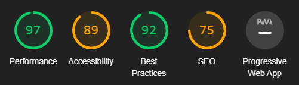

# SpeakUp - My CS50 Final Project

## Introduction

This was my final project for CS50X.
My final project is called SpeakUp, a blogging site with a simple interface that allows even the most basic of users to write a blog.

## Stack

I chose to use technologies we used over the term of the course,
including:
- [Bootstrap](https://getbootstrap.com) - For my Design
- [Python](https://python.org) - For the language of the back-end
- [Flask](https://flask.palletsprojects.com) - As my web framework
- [SQLite3](https://sqlite.org) - As my database
- [Heroku](https://heroku.com) - For CI (Continuous Integration) / Deployment

*Microtechnologies*

- [Flask Session](https://flask-session.readthedocs.io/en/latest) - For storing user sessions
- [Markdown2](https://github.com/trentm/python-markdown2) - For parsing posts (which are stored in markdown)
- [Mailjet](https://www.mailjet.com) - For email sending API
- [Google Lighthouse](https://developers.google.com/web/tools/lighthouse/) - Website Speed Testing

## Security

An immediate task I was faced with was security,
I made sure the login and register forms can prevent hacking techniques such as XSS (Cross-site Scripting), and SQLi (Sequel Injection).

## Design

As I previously mentioned I used the web design framework *Bootstrap* in this project, for the reasons:

1. We used Bootstrap during the Web track of the course
2. It is simple to use and easy to expand upon
3. It is mobile-friendly (responsive) making my life so much easier by not having to use many media queries to try make it responsive which most likely won't even look good.

I used a software I have due to [Github Education](https://education.github.com) called [Bootstrap Studio](https://bootstrapstudio.io/) to design the basic elements of the site like the *navbar* and the *login and register forms*.

## Database

As I mentioned in my *stack* I'm using SQLite3 for my database as we used it during the course and it is lightweight and works with [Heroku](https://www.heroku.com/) easily.

## Core Functionality

Not forgetting this was a blogging site I quickly began developing the core functionality / key components of the site.

I created a seperate table for blogs and posts, and linked them with id's.

`The posts are linked to the blogs and the blogs are linked to the user.`

At this stage I had a functioning create blog feature and a functioning authentication system.

## Extra Functionality

This was probably one of the hardest steps as I had to add multiple features,
such as

- Editing and deleting blogs
- Creating, editing, and deleting posts
- Forgot password system which required a lot of effort which I will review later in the *README*
- And a security system only allowing you to control blogs you own while being able to view blogs and posts you don't

Once this was complete I had most of the main functionality done.

## Post Storage

I decided it would be easist to store *markdown-based* posts in files in the folder `/posts` as I didn't want to cram files into SQL values.

This will work for the scale of my project but I will try other ways in future especially for larger-scale projects.

## Deployment

I know it's not neccesary to *deploy / host* your website, but I decided it would be a great way to actually **share my project to the world** while also expanding my skillsets,

I learned how to:

1. Make the website ready for production
2. Use a PaaS (Platform as a Service) known as [Heroku](https://heroku.com)
3. Debug errors that might not happen on a local machine in a development environment but will on a larger-scale production environment.

You can now find the site on [speakup.cbrcode.com](http://speakup.cbrcode.com).

## Scalability

I made sure the website is able to handle concurrent HTTP requests and provide a decent speed and performance.

This means it can scale to a much bigger level than intended while keeping a decent speed and still working.

I used **Mailjet** as an API for emails to allow to send multiple emails at once and have less risk of any mail not sending, I was originally planning on using pythons default *SMTP* library but decided against it purely for allowing the website to grow with user demand.

## SEO (Search Engine Optimization)

The SEO score only placed 75 which I wasn't happy with until I figured out that some of my SEO tags (\<meta>) tags were dynamically filled with information, depending on blog, and blog posts,
which means it didn't get notiticed by Google Lighthouse.

I'm happy with the score but thankful CS50 has shown me areas I need to improve on.

## Things I've learned along CS50

- C
- Basic parts of Machine Code and the inner workings of a computer
- A deeper knowledge of technologies I already knew like Python, and Flask
- How to store a user session using Flask
- A deeper understanding of how to use Bootstrap
- Multiple methods of debugging

## Extra things I learned myself for this final project

- Making a site ready for production
- Basics of CI / Deployment
- More git functionality

## Development

**How to install and get this project working in a development environment**

1. Clone the repository with `$ git clone https://github.com/pigcake999/harvard.git` or Download the source code from Github in a zip file.
2. Create a file called `.env` in the main directory which includes `app.py`
3. In this file type the code `FLASK_ENV=development`
4. In case of Sequel Thread Errors change the environment to production with `FLASK_ENV=production`
5. Install the dependencies using `$ pip install -r requirements.txt`
6. To run the project simply type `$ flask run`

## Versioning

I use [SemVer](http://semver.org/) for versioning. For the versions available, see the [tags on this repository](https://github.com/pigcake999/harvard/tags). 

## Authors

* **Christian Barton Randall** - *Coding and Maintaining* - [pigcake999](https://github.com/pigcake999)

 If I ever add any contributors they will appear [here](https://github.com/pigcake999/harvard/contributors).
 
## License

This project is not licensed https://choosealicense.com/no-permission/

But I hereby grant use of this code for **undistributed** personal use.

## Acknowledgements

- My parents for making me do CS50 even though I didn't want to at the start
- David Malan for being an amazing professor who is easy to understand and can teach advanced concepts in a short amount of time
- All the people who run CS50/CS50x for making an amazing course and giving me such a great oppurtunity.